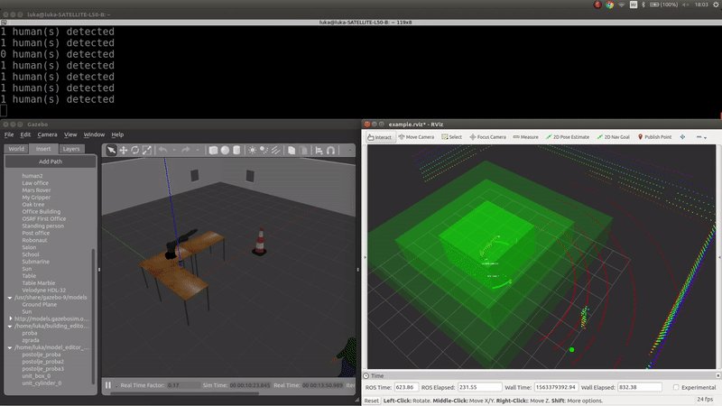
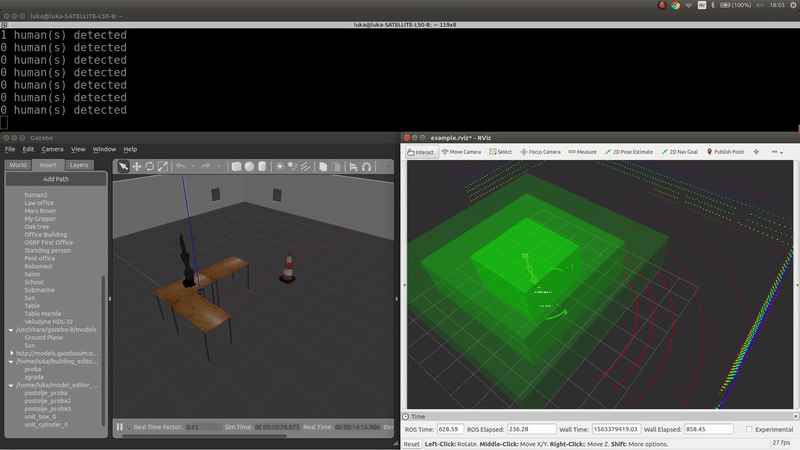
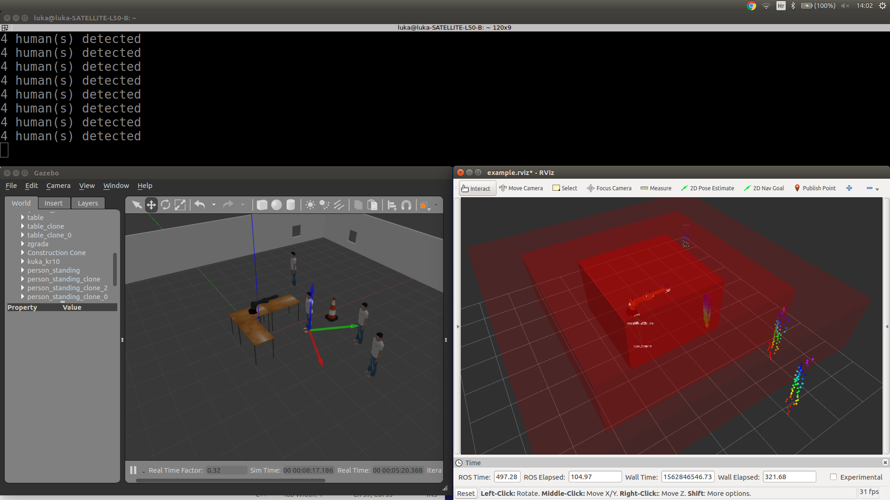
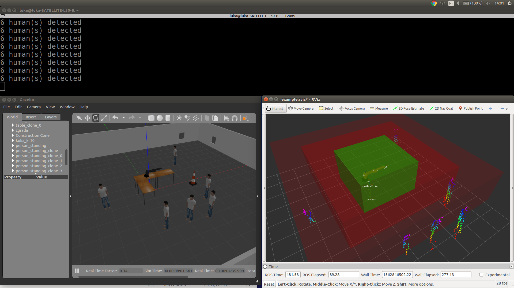

# human-detection-lidar

Change topic from **velodyne_points** to **velodyne_points_new** at 59. line in [heightmap_modified](https://github.com/2sin2x/human-detection-lidar/blob/master/velodyne_height_map-master/src/heightmap_modified.cpp) in order to work with simulation. For use with .bag use **velodyne_points**.

## Simulation results
### Simulation preview:


### Dynamic zones:




### Human count:




## Results with .bag


## Start simulation:

```
roslaunch velodyne_description start_simulation.launch

roslaunch my_pcl_tutorial limit_filtering_box.launch 

rosrun my_pcl_tutorial sub_simulation

rosrun velodyne_height_map heightmap_node_modified _grid_dimensions:=44 _cell_size:=0.25 _full_clouds:=true _height_threshold:=0.6

rosrun my_pcl_tutorial velocity_addon

rosrun robot_pose_publisher robot_pose_publisher_modified

roslaunch kuka_kr10_moveit_config demo.launch
```

## For use with .bag:

```
roscore

rosbag play -l <bagfile>.bag

rviz

rosrun my_pcl_tutorial velocity_addon

rosrun my_pcl_tutorial sub_borongaj

rosrun velodyne_height_map heightmap_node_modified _grid_dimensions:=40 _cell_size:=0.25 _full_clouds:=true _height_threshold:=0.2
```
